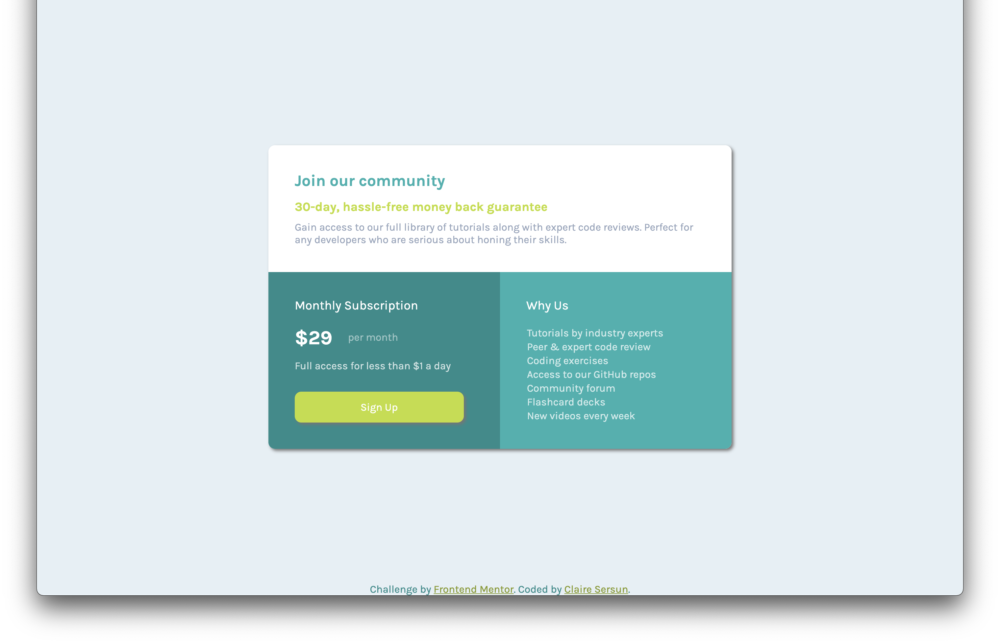

# Frontend Mentor - Single price grid component solution

This is a solution to the [Single price grid component challenge on Frontend Mentor](https://www.frontendmentor.io/challenges/single-price-grid-component-5ce41129d0ff452fec5abbbc). Frontend Mentor challenges help you improve your coding skills by building realistic projects. 

## Table of contents

- [Overview](#overview)
  - [The challenge](#the-challenge)
  - [Screenshot](#screenshot)
  - [Links](#links)
- [My process](#my-process)
  - [Built with](#built-with)
  - [What I learned](#what-i-learned)
  - [Continued development](#continued-development)
- [Author](#author)

**Note: Delete this note and update the table of contents based on what sections you keep.**

## Overview

### The challenge

Users should be able to:

- View the optimal layout for the component depending on their device's screen size
- See a hover state on desktop for the Sign Up call-to-action

### Screenshot




### Links

- Solution URL: [https://github.com/clairesersun/single-price-grid-compenent-challenge-from-frontent-mentor](https://github.com/clairesersun/single-price-grid-compenent-challenge-from-frontent-mentor)
- Live Site URL: [https://clairesersun.github.io/single-price-grid-compenent-challenge-from-frontent-mentor/](https://clairesersun.github.io/single-price-grid-compenent-challenge-from-frontent-mentor/)

## My process
I built from the ground up by building a Sematic HTML5 markup structure with accessibility in mind. Once the framework was built, I started layering CSS styling. I started with overall themes and built layer by layer down the screen to mimic the designer's vision. I then played with resizing display sizes and created media queries so that the informaiton is pleasantly viewable in all screensizes.
### Built with

- Semantic HTML5 markup
- CSS custom properties
- CSS Grid
- Mobile-first workflow

### What I learned

I played with media queries for the first time during this challenge. It was useful to bounce back and forth between the live port, Chrome Inspect tool, and my stylesheet to find the best solutions to my layout. I was excited to land on this section layout solution for smaller display screens:
```css
@media only screen 
and (max-width: 700px) {
    section.darker-back, section.cyan-back {
        clear: both;
        width: 100%;
        height: 100%;
        border-radius: 10px;
    }
}
```

Also, I appreciated the following feature of autofocusing on a button. It, along with the styling, draws the user to what is important on the screen.
```html
<button type="button" autofocus>Sign Up</button>
```

I learned how to remove and style list styles:
```css
li {
    list-style-type: none;
}
```

At one point I had a white square behind my dialog section. This was wehn I was adding the border-radius. I learned that the parent element must be smaller than the child. Hence, the following code emerged:
```css
dialog {
    margin: auto;
    top: 50%;
    bottom: 50%; 
    background: transparent;
    border-radius: 10px;    
    box-shadow: 3px 3px 5px #757575;
}

section.white-back {
    height: 100%;
    background: hsl(0, 0%, 100%);
    padding: 40px;
    border-radius: 10px 10px 0 0;
    -moz-border-radius: 10px 10px 0 0;
    -webkit-border-radius: 10px 10px 0 0; 
}
```

### Continued development

-Media Queries

## Author

- Website - [Claire Sersun](https://www.clairesersun.com/)
- Frontend Mentor - [@clairesersun](https://www.frontendmentor.io/profile/clairesersun)
- LinkedIn - [Claire Sersun](https://www.linkedin.com/in/clairesersun/)